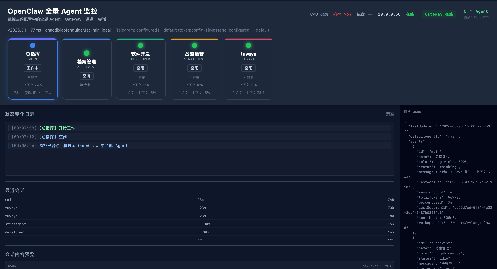

# OpenClaw Agent 监控

基于 [OpenClaw](https://github.com/openclaw/openclaw) 的全量 Agent 状态与会话内容可视化监控。通过轮询 `openclaw status --json` 与会话 `.jsonl` 文件，在单一仪表盘中展示所有 Agent、Gateway、系统资源与最近对话预览。


---

## 功能特性

- **全量 Agent 监控**：自动发现 `openclaw.json` 中配置的全部 Agent，无需写死列表；每个 Agent 显示状态（空闲/工作中）、会话数、上下文占用、最近活动时间。
- **Gateway 与通道**：展示网关是否在线、延迟、版本、主机名；通道配置摘要（如 Telegram、iMessage）。
- **系统信息**：顶部状态栏显示本机 CPU、内存、磁盘使用率，本机 IP，外网连通状态（ping 8.8.8.8）。
- **状态变化日志**：Agent 从「空闲」变为「工作中」或反向时自动打点，带时间戳，可清空。
- **最近会话列表**：按会话展示 agentId、距今年龄、上下文占用百分比。
- **会话内容预览**：为最近若干会话读取对应 `.jsonl`，展示最后几条用户/助手文本消息，**最新一条在上**并标注「(最新)」。
- **纯前端 + 单 JSON 数据源**：仪表盘为静态 HTML，通过定时请求 `agent-status.json` 更新，无后端服务；写入由独立 Node 脚本完成。

---

## 架构与数据流

```
┌─────────────────────────────────────────────────────────────────┐
│  openclaw status --json    会话 .jsonl（按 sessionId）           │
│  + 本机系统信息（CPU/内存/磁盘/IP/网络）                          │
└───────────────────────┬────────────────────────────────────────┘
                         │ 每 5 秒轮询 / 按会话读取
                         ▼
┌─────────────────────────────────────────────────────────────────┐
│  agent-status-writer.js（Node）                                  │
│  输出：agent-status.json                                          │
└───────────────────────┬────────────────────────────────────────┘
                         │ 静态文件
                         ▼
┌─────────────────────────────────────────────────────────────────┐
│  agent-dashboard.html                                            │
│  每 2 秒 fetch agent-status.json，渲染 Agent 卡片、日志、会话预览   │
└─────────────────────────────────────────────────────────────────┘
```

- **唯一数据源**：`agent-status.json`（由 writer 生成，不提交到 Git）。
- **运行环境**：writer 需在已安装 OpenClaw 的机器上运行，且能执行 `openclaw status --json`；仪表盘仅需通过 HTTP 访问该目录（或同源下的 `agent-status.json`）。

---

## 文件说明

| 文件 | 说明 |
|------|------|
| **agent-status-writer.js** | 状态写入器。轮询 `openclaw status --json`，采集 Agent、Gateway、通道、系统信息；为最近 N 个会话读取对应 `.jsonl` 最后几条 user/assistant 消息，写入 `agent-status.json`。 |
| **agent-dashboard.html** | 单页仪表盘。展示 Agent 卡片、Gateway、系统信息、状态变化日志、最近会话、会话内容预览、原始 JSON 面板。 |
| **.gitignore** | 忽略 `agent-status.json`、`.DS_Store`，避免将运行时数据与系统文件提交到仓库。 |

---

## 环境与依赖

- **Node.js**：用于运行 `agent-status-writer.js`（无额外 npm 依赖）。
- **OpenClaw**：本机已安装并配置，可执行 `openclaw status --json`；会话数据路径通常为 `~/.openclaw/agents/<agentId>/sessions/`（或通过 `OPENCLAW_STATE_DIR` 等配置）。
- **浏览器**：仪表盘需通过 HTTP 访问（不能使用 `file://`），否则无法加载 `agent-status.json`。

---

## 安装与部署

### 1. 克隆或下载本仓库

```bash
git clone https://github.com/vvlang/openclaw-agent-monitor.git
cd openclaw-agent-monitor
```

或将本仓库内容复制到任意目录（如 `~/.clawdbot/status`、Synology Drive 下的「START启动面板」等）。

### 2. 本地直接使用

**终端 1：启动写入器**

```bash
node agent-status-writer.js
```

保持运行；脚本每 5 秒执行一次 `openclaw status --json` 并更新 `agent-status.json`。

**终端 2：启动静态服务并打开仪表盘**

```bash
npx -y serve -p 3880
```

浏览器访问：**http://localhost:3880/agent-dashboard.html**

- 本仓库若自带 `start.sh`，其逻辑一般为：后台启动 `node agent-status-writer.js`，前台执行 `npx -y serve -p 3880`；停止面板应用时会一并结束 writer 与 HTTP 服务。

### 3. 后台常驻（可选）

使用 `pm2`、`launchd` 或 `systemd` 等将 `node agent-status-writer.js` 设为常驻；仪表盘仍通过单独的 HTTP 服务（如 `serve`、nginx）访问同一目录。此时需保证 writer 与 HTTP 服务都能读到/提供同一路径下的 `agent-status.json`。

---

## 仪表盘功能说明

- **顶部左侧**：标题与副标题。
- **顶部右侧**：系统信息（CPU / 内存 / 磁盘 使用率、本机 IP、网络在线/离线）→ Gateway 状态徽章 → Agent 数量与数据更新时间。
- **Gateway 行**：网关版本、延迟、主机名；通道摘要（如 Telegram、iMessage）。
- **Agent 卡片**：每个 Agent 一块卡片，含状态灯（绿=空闲，蓝=工作中）、名称、ID、会话数、上下文占用、简短状态文案。
- **状态变化日志**：Agent 状态变化时追加一条带时间戳的日志；支持「清空」。
- **最近会话**：表格形式展示 agentId、距今年龄、上下文占用。
- **会话内容预览**：每个会话卡片内为最近几条用户/助手消息，**最新一条在最上方**并标「(最新)」；用户消息与助手消息用不同颜色区分。
- **右侧**：原始 `agent-status.json`，便于调试。

---

## 配置与自定义

### writer 常量（agent-status-writer.js 顶部）

| 常量 | 默认值 | 说明 |
|------|--------|------|
| `CHECK_INTERVAL_MS` | 5000 | 轮询 `openclaw status --json` 的间隔（毫秒）。 |
| `ACTIVE_AGE_MS` | 120000 | 某 Agent 最后活动距今年龄小于此时视为「工作中」(thinking)，否则「空闲」(idle)。 |
| `SESSION_CONTENT_PREVIEW_MAX` | 10 | 最多为多少个最近会话读取并写入会话内容预览。 |
| `SESSION_JSONL_LAST_LINES` | 50 | 每个会话的 `.jsonl` 只读最后 N 行，用于提取消息。 |
| `PREVIEW_TEXT_LEN` | 120 | 每条消息预览的最大字符数，超出以「…」截断。 |
| `PREVIEW_MESSAGES` | 4 | 每个会话保留最近几条 user/assistant 消息。 |

修改后需重启 writer 生效。

### 仪表盘

- 数据请求间隔在 `agent-dashboard.html` 内为 2 秒（`setInterval(fetchData, 2000)`），可按需修改。
- 静态服务端口若不用 3880，需与 `start.sh` 或启动面板中的 `web_url` 一致。

### 会话路径说明

writer 使用的会话目录来自 `openclaw status --json` 中的 `sessions.byAgent[].path` 的所在目录（即各 Agent 的 `sessions` 目录）。通常为 `~/.openclaw/agents/<agentId>/sessions/`，与 OpenClaw 实际使用的路径一致。

---

## 故障排查

- **仪表盘显示「暂无 Agent」或「等待数据」**
  - 确认 writer 正在运行且无报错。
  - 确认本机可执行 `openclaw status --json` 且输出包含 `agents.agents`。
  - 若 writer 与仪表盘不在同一台机器，需保证仪表盘能通过 HTTP 访问到 writer 所在机器上的 `agent-status.json`（同源或配置 CORS）。

- **会话内容预览为空**
  - writer 只为「最近会话」列表中的前若干条会话读取 `.jsonl`。
  - 确认对应会话的 `.jsonl` 路径存在且可读（路径来自 `status --json` 的 byAgent）。
  - 预览只包含 `role` 为 `user` 或 `assistant` 且带文本内容的行；`toolCall`/`toolResult` 等不会显示。

- **系统信息（CPU/内存/磁盘/网络）为 --**
  - writer 在采集系统信息时若执行失败（如 `top`/`df`/`ping` 不可用或权限问题），对应项会为 null。
  - macOS 与 Linux 使用不同命令（如 `top -l 1 -n 0` vs `top -b -n 1`）；若为其他系统，可能需在 writer 中增加分支或降级为仅显示 load/内存。

- **局域网访问仪表盘**
  - 使用 `npx serve -p 3880` 时，同一局域网内可通过 `http://本机IP:3880/agent-dashboard.html` 访问。
  - 若需从外网或 HTTPS 访问，需自行配置反向代理或隧道（如 nginx、Caddy、Tailscale）。

---

## 安全与隐私

- **agent-status.json**：包含本机 Agent 列表、会话摘要、系统信息、最近消息预览等，请勿暴露到公网或不可信环境；已加入 `.gitignore`，不会随仓库推送。
- **系统信息**：CPU/内存/磁盘/IP/网络状态仅在 writer 所在机器上采集，供仪表盘展示，不发送到第三方。
- **会话内容预览**：从本地 `.jsonl` 读取并写入 `agent-status.json`，仅建议在可信环境（本机或内网）使用。

---

## 许可证与贡献

本仓库为 OpenClaw 的配套监控工具，可按需二次开发或集成到自有启动面板。若你基于此做了改进，欢迎在 GitHub 提 Issue 或 Pull Request。
