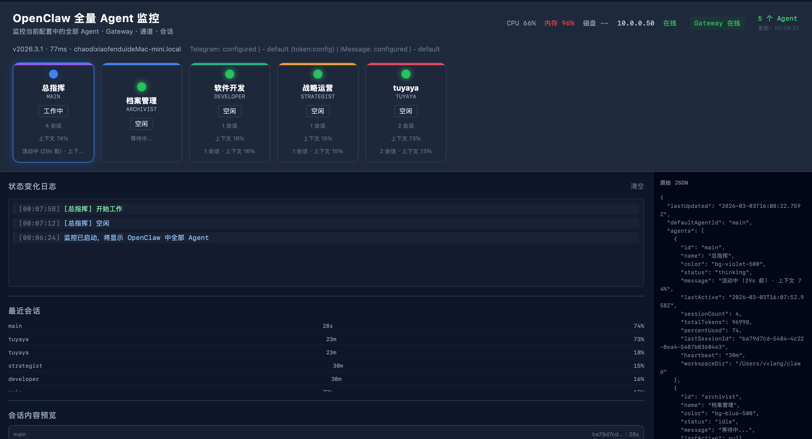

# OpenClaw Agent 监控

基于 [OpenClaw](https://github.com/openclaw/openclaw) 的全量 Agent 状态与会话内容可视化监控。通过轮询 `openclaw status --json` 与会话 `.jsonl` 文件，在单一仪表盘中展示所有 Agent、Gateway、系统资源、Token 统计、角色记忆与成本设置。


---

## 功能特性

- **全量 Agent 监控**：自动发现 `openclaw.json` 中配置的全部 Agent，无需写死列表；每个 Agent 显示状态（空闲/工作中）、会话数、上下文占用、最近活动时间。
- **Gateway 与通道**：展示网关是否在线、延迟、版本、主机名；通道配置摘要（如 Telegram、iMessage）。
- **系统信息**：顶部状态栏显示本机 CPU、内存、磁盘使用率，本机 IP，外网连通状态（ping 8.8.8.8）。
- **Token 统计**：总会话数、当前合计（各 Agent 最近会话 Token 之和）、**累计**（自 writer 启动以来按会话增量累加，持久化于 `token-cumulative-state.json`）；按 Agent 表格含「当前」与「累计」列。
- **角色记忆（交互式）**：每个 Agent 卡片提供「读取记忆」按钮，可按需拉取 memory-lancedb-pro 的 `agent:<id>` 与「读取全局记忆」拉取 `global`，点击后请求并展示，不阻塞页面。
- **成本设置**：模型 ID 从 OpenClaw 配置（`openclaw.json`）自动获取，可编辑各模型 input/output 单价（美元/百万 Token）并保存到 `model-pricing.json`，供后续成本估算。
- **状态变化日志**：Agent 从「空闲」变为「工作中」或反向时自动打点，带时间戳，可清空。
- **最近会话列表**：按会话展示 agentId、距今年龄、Token、上下文占用百分比。
- **会话内容预览**：为最近若干会话读取对应 `.jsonl`，展示最后几条用户/助手文本消息，**最新一条在上**并标注「(最新)」。
- **单进程部署**：writer 内置 HTTP 服务，同时提供仪表盘静态页、`agent-status.json`、`GET/POST /cost-config`、`GET /memory?scope=`，无需单独起静态服务。

---

## 架构与数据流

```
┌─────────────────────────────────────────────────────────────────┐
│  openclaw status --json    会话 .jsonl    openclaw.json          │
│  + 本机系统信息    + openclaw memory-pro list（按需）             │
└───────────────────────┬────────────────────────────────────────┘
                         │ 每 5 秒轮询 / 按会话读取 / 按需记忆
                         ▼
┌─────────────────────────────────────────────────────────────────┐
│  agent-status-writer.js（Node，单进程）                           │
│  · 输出 agent-status.json                                        │
│  · HTTP 服务（默认 3880）：仪表盘、agent-status.json、/cost-config、  │
│    /memory?scope=global|agent:<id>                               │
└───────────────────────┬────────────────────────────────────────┘
                         │ 同源请求
                         ▼
┌─────────────────────────────────────────────────────────────────┐
│  agent-dashboard.html                                            │
│  每 2 秒 fetch agent-status.json；按需 GET /memory、GET/POST 成本   │
└─────────────────────────────────────────────────────────────────┘
```

- **数据与 API**：`agent-status.json` 由 writer 生成（不提交 Git）；成本配置存 `model-pricing.json`（可选）；Token 累计状态存 `token-cumulative-state.json`（不提交）。
- **运行环境**：writer 需在已安装 OpenClaw 的机器上运行；`openclaw status --json` 使用 spawn + 流式读取，读到完整 JSON 后立即结束子进程，兼容安装插件（如 openclaw-self-healing）后 CLI 不退出的情况。status/health/models/plugins 等 CLI 调用经全局串行队列执行，同一时刻仅一个 openclaw 子进程，避免进程堆积。仪表盘通过 writer 提供的 HTTP 同源访问。

---

## 文件说明

| 文件 | 说明 |
|------|------|
| **agent-status-writer.js** | 状态写入器 + HTTP 服务。轮询 `openclaw status --json`（spawn 流式读取，兼容插件导致不退出）；采集 Agent、Gateway、通道、系统信息、Token 与累计；为最近 N 个会话读取 `.jsonl` 写入 `agent-status.json`。Gateway 离线时自动直连 URL/`/health` 或 `openclaw health --json` 做备用判定。内置 HTTP（默认 3880）提供仪表盘、`agent-status.json`、`GET/POST /cost-config`、`GET /memory?scope=`。 |
| **agent-dashboard.html** | 单页仪表盘。展示 Agent 卡片、Gateway、系统信息、Token 统计（当前 + 累计）、状态变化日志、最近会话、会话内容预览、角色记忆（交互式）、成本设置、原始 JSON 面板。 |
| **start.sh** | 启动脚本：设置 `OPENCLAW_ALLOW_INSECURE_PRIVATE_WS=1` 后运行 `node agent-status-writer.js`（避免本机 `OPENCLAW_GATEWAY_URL` 导致 openclaw CLI 报 SECURITY ERROR），单进程无需单独静态服务。 |
| **model-pricing.json** | 成本配置（writer 同目录），由仪表盘「成本设置」保存；不提交则使用内置默认。 |
| **token-cumulative-state.json** | Token 累计状态（writer 同目录），按 Agent 记录上一会话 id/tokens 用于增量累加；不提交。 |
| **.gitignore** | 忽略 `agent-status.json`、`model-pricing.json`、`token-cumulative-state.json`、`.DS_Store`。 |

---

## 环境与依赖

- **Node.js**：用于运行 `agent-status-writer.js`（无额外 npm 依赖）。
- **OpenClaw**：本机已安装并配置，可执行 `openclaw status --json`；会话数据路径通常为 `~/.openclaw/agents/<agentId>/sessions/`（或通过 `OPENCLAW_STATE_DIR` 等配置）。
- **浏览器**：仪表盘需通过 HTTP 访问（不能使用 `file://`），否则无法加载 `agent-status.json`。

---

## 安装与部署

### 1. 克隆或下载本仓库

```bash
git clone https://github.com/vvlang/openclaw-agent-monitor.git
cd openclaw-agent-monitor
```

或将本仓库内容复制到任意目录（如 `~/.clawdbot/status`、Synology Drive 下的「START启动面板」等）。

### 2. 本地直接使用

```bash
./start.sh
```

或直接：

```bash
node agent-status-writer.js
```

`start.sh` 会设置 `OPENCLAW_ALLOW_INSECURE_PRIVATE_WS=1`（若本机通过环境变量或 `~/.openclaw/.env` 配置了 `OPENCLAW_GATEWAY_URL`，openclaw CLI 可能报 SECURITY ERROR，该变量可避免），然后每 5 秒轮询 `openclaw status --json` 并更新 `agent-status.json`，同时启动 HTTP 服务（默认端口 3880）。浏览器访问：**http://localhost:3880/agent-dashboard.html** 即可打开仪表盘，无需单独运行 `serve`。

### 3. 后台常驻（可选）

使用 `pm2`、`launchd` 或 `systemd` 等将 `node agent-status-writer.js` 设为常驻；访问时直接请求 writer 所在机器的 3880 端口（或通过 nginx 反向代理）。

---

## 仪表盘功能说明

- **顶部左侧**：标题与副标题。
- **顶部右侧**：系统信息（CPU / 内存 / 磁盘 使用率、本机 IP、网络在线/离线）→ Gateway 状态徽章 → Agent 数量与数据更新时间。
- **Gateway 行**：网关版本、延迟、主机名；通道摘要（如 Telegram、iMessage）。
- **Agent 卡片**：每个 Agent 一块卡片，含状态灯（绿=空闲，蓝=工作中）、名称、ID、会话数、上下文占用、简短状态文案、**「读取记忆」按钮**（点击后拉取该角色 memory-pro 记忆并展示）。
- **Token 统计**：总会话数、当前合计、累计（持久化累计）；按 Agent 表格展示「当前」会话 Token、「累计」Token 与上下文%。最近会话表格支持 Token 列。
- **状态变化日志**：Agent 状态变化时追加一条带时间戳的日志；支持「清空」。
- **最近会话**：表格形式展示 agentId、距今年龄、Token、上下文占用。
- **会话内容预览**：每个会话卡片内为最近几条用户/助手消息，**最新一条在最上方**并标「(最新)」；用户消息与助手消息用不同颜色区分。
- **角色记忆**：「读取全局记忆」与各 Agent 卡片下「读取记忆」为交互式拉取，点击后请求 `/memory?scope=global` 或 `scope=agent:<id>` 并展示，记忆来源为 memory-lancedb-pro。
- **成本设置**：模型 ID 从 OpenClaw 配置（`~/.openclaw/openclaw.json`）自动获取；可编辑各模型 inputPerM、outputPerM（美元/百万 Token）并「保存」到 `model-pricing.json`。
- **右侧**：原始 `agent-status.json`，便于调试。

---

## 配置与自定义

### 环境变量（writer）

| 环境变量 | 默认值 | 说明 |
|----------|--------|------|
| `OPENCLAW_MONITOR_INTERVAL_MS` | 5000 | 轮询间隔（毫秒）。 |
| `OPENCLAW_MONITOR_TIMEOUT_MS` | 5000 | `openclaw status` 及系统采集命令的超时（毫秒），慢网络可适当调大。 |
| `OPENCLAW_MONITOR_REDACT_PATHS` | 未设置 | 设为 `1` 时不在 JSON 中输出本机路径（`workspaceDir`、gateway `url`/`host`/`ip` 等），降低泄露风险。 |
| `OPENCLAW_MONITOR_NO_CONTENT_PREVIEW` | 未设置 | 设为 `1` 时不写入 `recentSessions[].contentPreview`，避免对话文本进入同步文件。 |
| `OPENCLAW_MONITOR_NO_MEMORY` | 未设置 | 设为 `1` 时不拉取角色记忆（`openclaw memory-pro list`），不写入 `memoryGlobal` 与 `agents[].memoryEntries`。 |
| `OPENCLAW_MONITOR_MEMORY_LIMIT` | 30 | 每个 scope（global、agent:&lt;id&gt;）最多拉取的记忆条数（5–100）。 |
| `OPENCLAW_MONITOR_MEMORY_INTERVAL_MS` | 30000 | 角色记忆**单独**轮询间隔（毫秒）。记忆使用异步拉取、不与 5s 状态轮询同频，避免 agent 运行时阻塞页面。 |
| `OPENCLAW_MONITOR_MEMORY_CONCURRENCY` | 2 | 同时拉取记忆的 scope 数量上限（1–10）。Agent 多时若曾出现 openclaw 进程爆炸，可保持 2 或调小。 |
| `OPENCLAW_MONITOR_MEMORY_CACHE_TTL_MS` | 20000 | 仪表盘 GET /memory 响应缓存时间（毫秒），重复点击「读取记忆」时命中缓存不重复起进程。 |
| `OPENCLAW_MONITOR_MEMORY_DEBUG` | 未设置 | 设为 `1` 时在终端输出记忆解析调试日志。 |
| `OPENCLAW_MONITOR_PORT` | 3880 | writer 内置 HTTP 服务端口。 |
| `OPENCLAW_DIR` | `~/.openclaw` | OpenClaw 配置目录，用于读取 `openclaw.json`（成本设置模型 ID、可选）。 |
| `OPENCLAW_MONITOR_GATEWAY_URL` | `http://127.0.0.1:18789` | 当 `openclaw status` 未提供 gateway URL 或报离线时，writer 直连探测用的备用网关地址（需与 OpenClaw 实际端口一致）。若 status 提供的 URL 探测失败，writer 会再尝试此 fallback。 |
| `OPENCLAW_MONITOR_GATEWAY_CACHE_MS` | 60000 | 探测结果缓存时间（毫秒）。此时间内 status 再报离线时直接复用上次结果，不重复探测，避免「一会在线一会离线」闪烁。 |
| `OPENCLAW_MONITOR_GATEWAY_DEBUG` | 未设置 | 设为 `1` 时输出直连探测的失败原因（status、error、timeout），便于排查「Gateway 实际在线但页面显示离线」。 |

**示例（Gateway 在远程/Tailscale 机器）**：若 Gateway 跑在 Tailscale 对端，可设置  
`OPENCLAW_MONITOR_GATEWAY_URL=https://mac-mini.tail365b.ts.net`（HTTPS 默认 443 端口；若 Gateway 监听其他端口则加 `:端口`）。  
直连探测通过 **curl** 执行：未设置时等价于 `curl http://127.0.0.1:18789`；设置后等价于 `curl -s -k <OPENCLAW_MONITOR_GATEWAY_URL>`（`-k` 与 Tailscale/自签名兼容）。  
启动示例：`OPENCLAW_MONITOR_GATEWAY_URL=https://mac-mini.tail365b.ts.net ./start.sh`

### writer 常量（agent-status-writer.js 顶部，无环境变量时生效）

| 常量 | 默认值 | 说明 |
|------|--------|------|
| `ACTIVE_AGE_MS` | 120000 | 某 Agent 最后活动距今年龄小于此时视为「工作中」(thinking)，否则「空闲」(idle)。 |
| `SESSION_JSONL_LAST_LINES` | 50 | 每个会话的 `.jsonl` 只读最后 N 行，用于提取消息。 |
| `PREVIEW_TEXT_LEN` | 120 | 每条消息预览的最大字符数，超出以「…」截断。 |
| `PREVIEW_MESSAGES` | 4 | 每个会话保留最近几条 user/assistant 消息。 |

修改后需重启 writer 生效。

### 仪表盘

- 数据请求间隔在 `agent-dashboard.html` 内为 2 秒（`setInterval(fetchData, 2000)`），可按需修改。
- 端口由 writer 的 `OPENCLAW_MONITOR_PORT` 决定（默认 3880），与 `start.sh` 或启动面板中的 `web_url` 一致即可。

### 会话路径说明

writer 使用的会话目录来自 `openclaw status --json` 中的 `sessions.byAgent[].path` 的所在目录（即各 Agent 的 `sessions` 目录）。通常为 `~/.openclaw/agents/<agentId>/sessions/`，与 OpenClaw 实际使用的路径一致。

---

## 故障排查

- **仪表盘显示「暂无 Agent」或「等待数据」**
  - 确认 writer 正在运行且无报错（单进程下仪表盘与 API 均由 writer 提供，同源）。
  - 确认本机可执行 `openclaw status --json` 且输出包含 `agents.agents`。若安装 openclaw-self-healing 等插件后 CLI 不退出或报 SECURITY ERROR，请用 **`./start.sh`** 启动（会设置 `OPENCLAW_ALLOW_INSECURE_PRIVATE_WS=1`），或勿在环境中设置 `OPENCLAW_GATEWAY_URL`（参见 [openclaw/openclaw#11843](https://github.com/openclaw/openclaw/issues/11843)）。
  - 若通过反向代理或另一台机器访问，需保证能访问 writer 的端口（默认 3880）及 `agent-status.json`、`/cost-config`、`/memory` 等路径。

- **Gateway 显示离线但 OpenClaw 实际在运行**
  - writer 在 status 报离线时会自动做备用检测：直连 `OPENCLAW_MONITOR_GATEWAY_URL`（默认 `http://127.0.0.1:18789`）、请求 `/health`、或执行 `openclaw health --json`。若网关端口不是 18789，请设置 `OPENCLAW_MONITOR_GATEWAY_URL=http://127.0.0.1:你的端口`。

- **会话内容预览为空**
  - writer 只为「最近会话」列表中的前若干条会话读取 `.jsonl`。
  - 确认对应会话的 `.jsonl` 路径存在且可读（路径来自 `status --json` 的 byAgent）。
  - 预览只包含 `role` 为 `user` 或 `assistant` 且带文本内容的行；`toolCall`/`toolResult` 等不会显示。

- **系统信息（CPU/内存/磁盘/网络）为 --**
  - writer 在采集系统信息时若执行失败（如 `top`/`df`/`ping` 不可用或权限问题），对应项会为 null。
  - macOS 与 Linux 使用不同命令（如 `top -l 1 -n 0` vs `top -b -n 1`）；若为其他系统，可能需在 writer 中增加分支或降级为仅显示 load/内存。

- **角色记忆显示「暂无记忆」**
  - 确认未设置 `OPENCLAW_MONITOR_NO_MEMORY=1`；点击「读取记忆」后查看页面上的记忆请求日志与浏览器控制台、writer 终端日志（可开 `OPENCLAW_MONITOR_MEMORY_DEBUG=1`）排查。
- **成本设置模型列表为空**
  - 确认 `OPENCLAW_DIR` 指向的目录下存在 `openclaw.json`（或 `clawdbot.json`），且其中 `models.providers` 或 `agents` 含模型配置。
- **局域网访问仪表盘**
  - writer 监听 0.0.0.0 时，同一局域网可通过 `http://本机IP:3880/agent-dashboard.html` 访问。
  - 若需从外网或 HTTPS 访问，需自行配置反向代理或隧道（如 nginx、Caddy、Tailscale）。

---

## 安全与隐私

- **agent-status.json**：包含本机 Agent 列表、会话摘要、系统信息、最近消息预览、Token 累计等，请勿暴露到公网或不可信环境；已加入 `.gitignore`，不会随仓库推送。
- **model-pricing.json**：成本配置存于 writer 同目录，仅本机或内网使用；已加入 `.gitignore`。
- **token-cumulative-state.json**：Token 累计状态，仅本机使用；已加入 `.gitignore`。
- **系统信息**：CPU/内存/磁盘/IP/网络状态仅在 writer 所在机器上采集，供仪表盘展示，不发送到第三方。
- **会话内容预览**：从本地 `.jsonl` 读取并写入 `agent-status.json`，仅建议在可信环境（本机或内网）使用。
- **角色记忆**：交互式请求 `/memory?scope=` 会执行 `openclaw memory-pro list`，返回内容仅供仪表盘展示，建议仅在本机或内网使用。

---

## 许可证与贡献

本仓库为 OpenClaw 的配套监控工具，可按需二次开发或集成到自有启动面板。若你基于此做了改进，欢迎在 GitHub 提 Issue 或 Pull Request。
